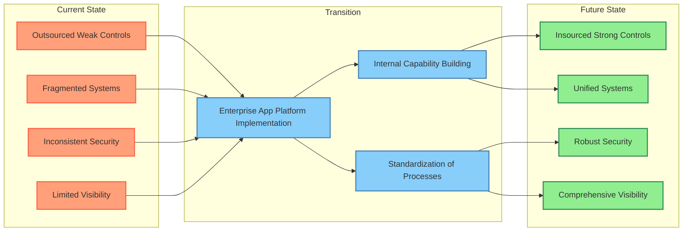

# Enterprise Application Consolidation (organisations > 200k staff)

## Enhanced Security and Control

Centralized vulnerability management enables targeting current weaknesses across all platforms and implementing evolving controls such as zero trust architectures and phishing resistant multifactor authentication at scale.

Improve security visibility and response capabilities

- Improve Service Continuity: Standardised approach ensures consistent uptime and reliability.
- Technical Debt Reduction: Modernise architecture and simplify systems under internal guidance.
- Operational Efficiency: Streamline resources and improve inter-team collaboration.
- Knowledge Retention and IP Protection:
    - Build and retain critical technical expertise within the organisation
    - Maintain control over architectural decisions and intellectual property
    - Reduce dependency on external vendors for core competencies

## Sector wide Vulnerability Management

- Implement sector-wide vulnerability assessment and remediation processes
- Establish a operational security capability for proactive threat detection
- Regular security audits and penetration testing managed internally

## Unified Identity and Access Management

- Standardize and strengthen multifactor authentication across all services
- Implement risk-based authentication for sensitive systems
- Centralized user lifecycle management and access control

## Cost-Effectiveness

- Initial investment offset by reduced long-term vendor costs and security risk reduction
- More efficient resource allocation for security and operations
- Increasing efficiency over time

## Agility and solution targeting

- Faster response to emerging security threats and changing needs
- Ability to implement tailored security solutions specific to organisations risk and exposure profile

## Workforce Development

- Create high-value interrnal roles and teams
- Develop a culture of security awareness and continuous improvement

## Strategic Alignment

- Ensure security initiatives closely align with org priorities
- Maintain direct accountability for cybersecurity across the sector

## Recommendation

Implementing this platform with internal capability over 1-2 years addresses critical security risks, expediting implementation of strong controls including vulnerability management and multifactor authentication. It builds valuable in-house expertise, enhances the overall security posture, and positions large organisations for more efficient, secure, and innovative digital service delivery while reducing long-term costs and dependence on external vendors.
