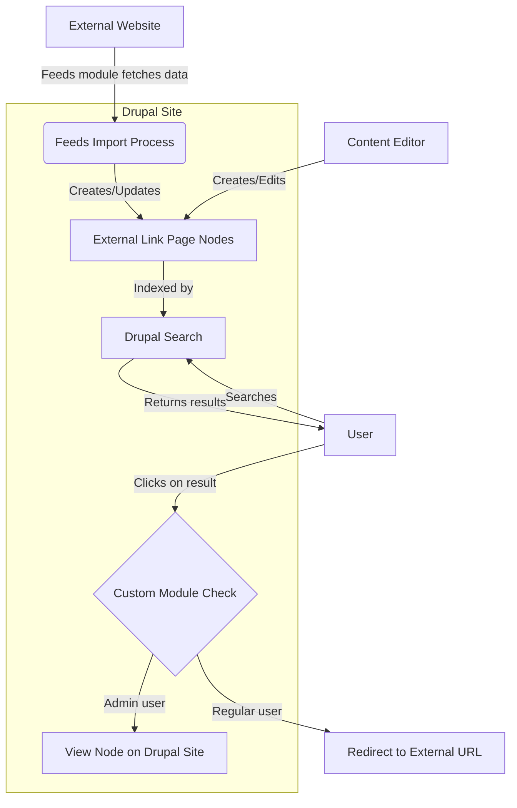

This diagram illustrates the flow:

1. The process starts with an external website, which is the source of content.

2. The Feeds module fetches data from the external website and processes it.

3. The Feeds import process creates or updates "External Link Page" nodes in Drupal.

4. These nodes are indexed by Drupal's search system.

5. When a user searches on the Drupal site, they get results that include these indexed external pages.

6. If a user clicks on a search result, the custom module checks the user's role:
   - If it's an admin user, they view the node on the Drupal site
   - If it's a regular user, they're redirected to the external URL

7. Content editors could also directly create or edit these "External Link Page" nodes within Drupal.

This diagram is a mockup of how the Feeds module, custom module, and Drupal's core features could work together to create a system that indexes external content while maintaining original source links for end-users.
