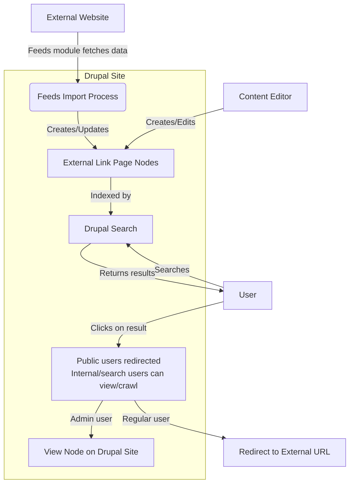

# Implementing External Link Indexing in Drupal

This guide will walk you through creating a custom Drupal module that allows you to index content from external sites while redirecting users to the original source when they attempt to view the content directly.

## Overview

1. Create a custom content type
2. Create a custom module
3. Configure Drupal search
4. (Optional) Integrate with Feeds module



This diagram illustrates the flow:

1. The process starts with an external website, which is the source of content.

2. The Feeds module fetches data from the external website and processes it.

3. The Feeds import process creates or updates "External Link Page" nodes in Drupal.

4. These nodes are indexed by Drupal's search system.

5. When a user searches on the Drupal site, they get results that include these indexed external pages.

6. If a user clicks on a search result, the custom module checks the user's role:
   - If it's an admin user, they view the node on the Drupal site
   - If it's a regular user, they're redirected to the external URL

7. Content editors could also directly create or edit these "External Link Page" nodes within Drupal.

This diagram is a mockup of how the Feeds module, custom module, and Drupal's core features could work together to create a system that indexes external content while maintaining original source links for end-users.

## Step 1: Create a Custom Content Type

1. Go to Structure > Content types > Add content type
2. Name it "External Link Page"
3. Add a "Body" field for the content to be indexed
4. Add a "Link" field (URL type) for the external URL, name it "field_external_url"

## Step 2: Create a Custom Module

1. In your Drupal installation's `modules/custom` directory, create a new folder named `simple_external_link`
2. Inside this folder, create three files:

### simple_external_link.info.yml

```yaml
name: Simple External Link
type: module
description: 'Redirects to external URL for a specific content type.'
core_version_requirement: ^9 || ^10
package: Custom
```

### simple_external_link.libraries.yml

```yaml
# This file is currently empty as we don't have any CSS or JS to add.
# You can add libraries here if needed in the future.
```

### simple_external_link.module

```php
<?php

/**
 * @file
 * Contains simple_external_link.module.
 */

use Drupal\Core\Entity\EntityInterface;
use Drupal\Core\Url;
use Symfony\Component\HttpFoundation\RedirectResponse;

/**
 * Implements hook_entity_view().
 */
function simple_external_link_entity_view(array &$build, EntityInterface $entity, $view_mode, $langcode) {
  if ($entity->getEntityTypeId() == 'node' 
      && $entity->bundle() == 'external_link_page' 
      && $view_mode == 'full'
      && !\Drupal::currentUser()->hasPermission('administer nodes')) {
    $external_url = $entity->get('field_external_url')->uri;
    if (!empty($external_url)) {
      $response = new RedirectResponse($external_url);
      $response->send();
      exit;
    }
  }
}

/**
 * Implements hook_help().
 */
function simple_external_link_help($route_name, \Drupal\Core\Routing\RouteMatchInterface $route_match) {
  switch ($route_name) {
    case 'help.page.simple_external_link':
      $output = '';
      $output .= '<h3>' . t('About') . '</h3>';
      $output .= '<p>' . t('The Simple External Link module provides functionality to redirect users to an external URL when viewing specific content types.') . '</p>';
      return $output;
  }
}
```

3. Enable the module through the Drupal admin interface (Extend) or using Drush:
   ```
   drush en simple_external_link
   ```

## Step 3: Configure Drupal Search

1. Go to Configuration > Search and metadata > Search pages
2. Edit the content search page
3. Ensure that your new "External Link Page" content type is included in the indexed content types

## Step 4: (Optional) Integrate with Feeds Module

To automatically import content from external sources:

1. Install the Feeds module:
   ```
   composer require drupal/feeds
   drush en feeds
   ```

2. Go to Structure > Feed types > Add feed type
3. Name it "External Site Feed"
4. Configure the fetcher, parser, and processor as appropriate for your data source
5. In the "Mapping" section, map incoming data to your "External Link Page" fields:
   - Title → Title
   - Description or Content → Body
   - Link → field_external_url

6. Go to Content > Feeds > Add feed
7. Choose your "External Site Feed" type
8. Enter the URL of your external data source
9. Run the import

## How It Works

- The custom module redirects non-admin users to the external URL when they try to view an "External Link Page" node directly.
- Admin users can view and edit these nodes normally.
- The node's content is indexed by Drupal's search, making it searchable on your site.
- When using Feeds, you can periodically import and update content from external sources.

## Notes

- This setup assumes your content type is named "external_link_page" and the URL field is "field_external_url". Modify the module code if you use different names.
