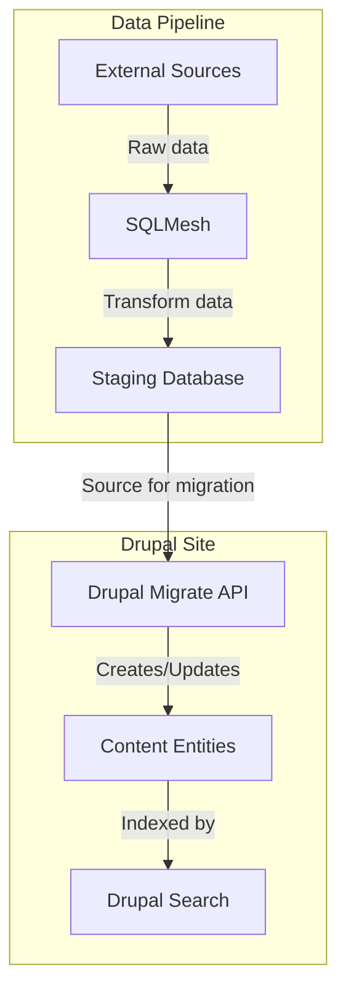

# Using SQLMesh and Drupal Migrate for external content ingestion

This guide outlines a process to ingest external content into Drupal using SQLMesh with Python models for data transformation and the Drupal Migrate API for data ingestion.

## Overview



## Steps

1. **Set up SQLMesh**
   - Install: `pip install sqlmesh`
   - Initialize project: `sqlmesh init my_project`

2. **Create Python SQLMesh Models**
   - Example `models/external_content.py`:

     ```python
     from sqlmesh import model, Column, field

     @model
     class ExternalContent:
         id: int = field(primary_key=True)
         title: str
         body: str
         external_url: str
         published_at: Column('timestamp')
         content_type: str

         @classmethod
         def transform(cls):
             return f"""
                 SELECT
                     id,
                     title,
                     body,
                     url AS external_url,
                     published_at,
                     type AS content_type
                 FROM raw_external_data
                 WHERE published_at > '2023-01-01'
             """
     ```

3. **Run SQLMesh**
   - Execute: `sqlmesh run`

4. **Configure Drupal Migration**
   - Install modules: `composer require drupal/migrate_plus drupal/migrate_tools`
   - Create `config/install/migrate_plus.migration.external_content.yml`:

     ```yaml
     id: external_content
     source:
       plugin: sql
       query: SELECT * FROM external_content
     process:
       type: content_type
       title: title
       body/value: body
       field_external_url: external_url
       created: 
         plugin: format_date
         from_format: 'Y-m-d H:i:s'
         to_format: 'U'
         source: published_at
     destination:
       plugin: entity:node
     ```

5. **Run Migration**
   - Execute: `drush migrate:import external_content`

6. **Implement Custom Module for Redirection (Optional)**
   - Create `modules/custom/external_content_redirect/external_content_redirect.module`:

     ```php
     <?php
     use Drupal\Core\Entity\EntityInterface;
     use Symfony\Component\HttpFoundation\RedirectResponse;

     function external_content_redirect_entity_view(array &$build, EntityInterface $entity, $view_mode, $langcode) {
       if ($entity->getEntityTypeId() == 'node' 
           && !empty($entity->field_external_url)
           && $view_mode == 'full'
           && !\Drupal::currentUser()->hasPermission('administer nodes')) {
         $external_url = $entity->field_external_url->uri;
         if (!empty($external_url)) {
           $response = new RedirectResponse($external_url);
           $response->send();
           exit;
         }
       }
     }
     ```

7. **Configure Drupal Search**
   - Ensure new content types are included in search indexing

## Notes

- Adjust the SQLMesh model and Drupal migration configuration to match your specific data structure.
- Schedule the SQLMesh and migration processes to run periodically for up-to-date content.
- Customize the redirection module based on your content structure and requirements.